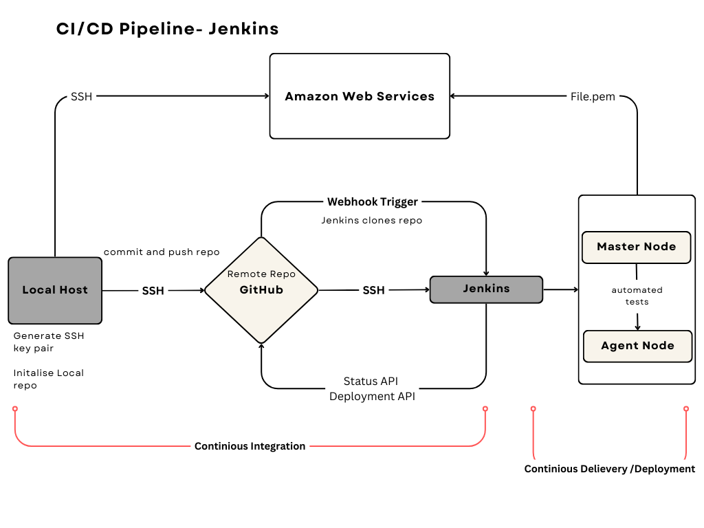

## CI/CD

### What is CI/CD ?

CI/CD stands for Continuous Integration and Continuous Deployment/Delivery. It's a set of practices and principles that aim to improve the software development process by automating various stages.

**Continuous Integration (CI)** is a development practice where developers integrate code into a shared repository frequently.Through this you are able to frequently merge change codes, build, test and run.

**Continuous Delivery (CI)** means code changes are automatically prepared for deployment, but a human makes the final decision to push it live.

**Continuous Deployment (CD)** means that as soon as a code change passes automated tests, it's automatically released to the live environment without any human intervention.

**Key Points**:
- **CI** stands for **Continious Integration**. 
  
- **CD** stands for **Continious Deployment/Delivery**. 
  
- CI/CD falls under **DevOps** and combines the practices of continuous integration and continuous delivery. 

- Allows organisations to deliver software quickly and efficiently.

- **Faster software builds** and **customer satisfaction** by deploying the app in time. 

- **Reduce risk on delivery** - Testing every change before it's deployed ensures that the result will be a higher quality product

### What is a CI/CD pipeline? 

A **CI/CD pipeline** is a set of automated steps that code goes through from development to deployment.

#### Explaning the diagram: 

**Local host**: This represents your own computer, where you are developing code, creating, managing local repositories and generating SSH key pairs. 

**GitHub**: You create your remote repository and create a secure connection using your public SSH key. Through this, you are then able to store and manage your repo and push and commit from your local repositories. 

**Generate new SSH Key Pair**

**Attach Public SSH Key to GitHub Repo:**
Add the public SSH key to your GitHub repository. This allows Jenkins to access the repository securely.

**Authenticate in Jenkins**: In Jenkins, add the private key to authenticate the connection. This private key links to the public key you attached to your GitHub repository.

**Jenkins**: can pull the code from GitHub repo, build, run and test. 

**Webhook Trigger** :creates a notification system between GitHub and Jenkins. Whenever there is a new commit or changes to the GitHub repo it notifies and triggers Jenkins to initiate the pipeline, automating the integration and testing process.
