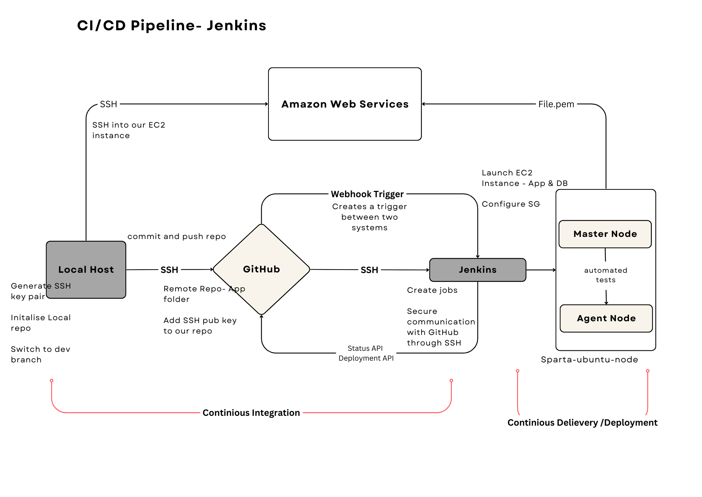

## CI/CD - Continous Integration / Continious Delivery and Deployment

### What is CI/CD ?

CI/CD stands for Continuous Integration and Continuous Deployment/Delivery. It's a set of practices and principles that aim to improve the software development process by automating various stages.

**Continuous Integration (CI)** is a development practice where developers integrate code into a shared repository frequently.Through this you are able to frequently merge change codes, build, test and run.

**Continuous Delivery (CI)** means code changes are automatically prepared for deployment, but a human makes the final decision to push it live.

**Continuous Deployment (CD)** means that as soon as a code change passes automated tests, it's automatically released to the live environment without any human intervention.

**Key Points**:
- **CI** stands for **Continious Integration**. 
  
- **CD** stands for **Continious Deployment/Delivery**. 
  
- CI/CD falls under **DevOps** and combines the practices of continuous integration and continuous delivery. 

- Allows organisations to deliver software quickly and efficiently.

- **Faster software builds** and **customer satisfaction** by deploying the app in time. 

- **Reduce risk on delivery** - Testing every change before it's deployed ensures that the result will be a higher quality product

## CI/CD Pipeline - Jenkins 

A **CI/CD pipeline** is a set of automated steps that code goes through from development to deployment.



From this diagram, I will explain the **Continuous integration** that has been implemented from local host to Jenkins and how we are going to set up a production environment CD from the CI/CD pipeline. 

## Continious Integration (CI)

**Local host** : This represents our own computer, where we develop, change code, Initalise and manage local repositories. This is also where we generate our **SSH key pairs** which we will use to establish a secure connection on remote servers. 
<br> 

During this process of continous integration, it is good practice to always work in a Dev branch as this allows multiple developers to work at once without interfering with each other's changes.


**GitHub** : Allows us to create our remote repository. We can push, commit our changes from local repo to remote repo through secure connection using our SSH key. 
<br> 

### Establishing a secure connection between GitHub and Jenkins

We have added the public SSH key to our GitHub repository. This allows Jenkins to access the repository securely.

 In Jenkins, we add the private key in order to authenticate and establish a secure communication with GitHub. This private key links to the public key we attached to our GitHub repository.This allows Jenkins to  pull the code from GitHub repo, build, run and test. 

### Automating CI

**Webhook Trigger** 

Webhook creats a notification system between GitHub and Jenkins. Whenever there is a new commit or changes made from our local host to our github repo, it notifies and triggers Jenkins to initiate the build. 

### Creating and Merging Jobs in Jenkins 

We created two jobs, in order to automate the process of merging and deploying code changes.

- We make changes to the code locally and push them to the dev branch.

- GitHub repository triggers a webhook, notifying Jenkins of the changes.

- Our first job is executed and starts the build.
  
- If the build is successful, Jenkins triggers second job.
  
- Second job fetches the latest changes from the dev branch, merges them into the main branch, and pushes the changes back to the main repository.

*Please refer to jenkins_merging_git_branches.md on how to create a new job in Jenkins.*

## Setting up Production Environment (CD)

1. **Create a new job in Jenkins** 
   
   This job should be triggered by the merge job we created and will be used to SSH into EC2.

   **Add Execute Command**

   In the job configuration, add a build step to **Execute shell script on remote host using ssh**. This command will be used to SSH into the EC2 instances and perform further action: 

   ```
   sudo apt upgrade -y 

   cd app/app
   npm install
   ```


2. **Create EC2 instance in AWS**
   
   One for the **app** and one for the **mongodb database**. We must remember to configure the security settings for the app instance so it allows connection to **port 8080 for Jenkins**. 

   We need to add security rule for our database instance to **port 27017 for mongodb**.

   *if using pre-configured AMI then nodejs must be installed.*

3. **SSH into EC2 from Local host**
   
