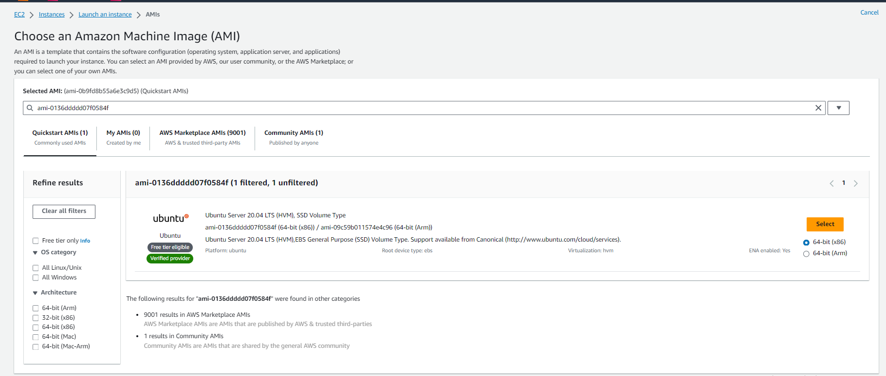
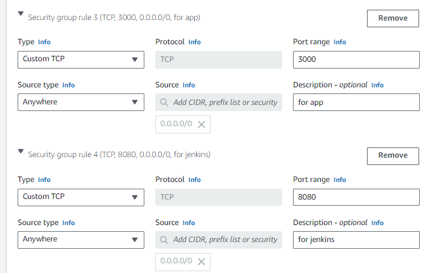

# CI/CD - Continuous Integration / Continious Delivery and Deployment


CI/CD stands for Continuous Integration and Continuous Deployment/Delivery. It's a set of practices and principles that aim to improve the software development process by automating various stages.

**Continuous Integration (CI)** is a development practice where developers integrate code into a shared repository frequently.Through this you are able to frequently merge change codes, build, test and run.

**Continuous Delivery (CI)** means code changes are automatically prepared for deployment, but a human makes the final decision to push it live.

**Continuous Deployment (CD)** means that as soon as a code change passes automated tests, it's automatically released to the live environment without any human intervention.

**Key Points**:

- **CI** stands for **Continuous Integration**.
  
- **CD** stands for **Continuous Deployment/Delivery**.
  
- CI/CD falls under **DevOps** and combines the practices of continuous integration and continuous delivery.

- Allows organisations to deliver software quickly and efficiently.

- **Faster software builds** and **customer satisfaction** by deploying the app in time.

- **Reduce risk on delivery** - Testing every change before it's deployed ensures that the result will be a higher quality product

## Building CI/CD Pipeline with Jenkins

A **CI/CD pipeline** is a set of automated steps that code goes through from development to deployment. The pipeline is responsible for building codes, running tests and deploying new software versions.


From this diagram, I will explain how **Continuous integration** has been implemented and how we are going to set up a production environment CD from the CI/CD pipeline.

## Continuous Integration (CI)

**Local host** : This represents our own computer, where we develop, change code, Initialise and manage local repositories. This is also where we generate our **SSH key pairs** which we will use to establish a secure connection on remote servers.
During this process of continuous integration, it is good practice to always work in a Dev branch as this allows multiple developers to work at once without interfering with each other's changes.

**GitHub** : Allows us to create our remote repository. We can push, commit our changes from local repo to remote repo through secure connection using our SSH key.
<br>

### Establishing a secure connection between GitHub and Jenkins

We have added the public SSH key to our GitHub repository. This allows Jenkins to access the repository securely. In Jenkins, we add the private key in order to authenticate and establish a secure communication with GitHub. This private key links to the public key we attached to our GitHub repository. This allows Jenkins to  pull the code from GitHub repo, build, run and test.

### Automating CI

**Webhook Trigger** - Webhook creates a notification system between GitHub and Jenkins. Whenever there is a new commit or changes made from our local host to our github repo, it notifies and triggers Jenkins to initiate the build.

### Creating and Merging Jobs in Jenkins

We created two jobs, in order to automate the process of merging and deploying code changes.

- We make changes to the code locally and push them to the dev branch.

- GitHub repository triggers a webhook, notifying Jenkins of the changes.

- Our first job is executed and starts the build.
  
- If the build is successful, Jenkins triggers second job.
  
- Second job fetches the latest changes from the dev branch, merges them into the main branch, and pushes the changes back to the main repository.

*Please refer to jenkins_merging_git_branches.md on how to create a new job in Jenkins.*

## Setting up Production Environment (CD)

### **Create a new job in Jenkins**
  - First, we need to create a new job in Jenkins. *i.e Prismika-CD*
  - This is our third job, this job should be triggered by the merge job. So we need to add post-build actions on our merge job to tell our third job to build upon successfully passing all test.
  - Need to enable '**SSH agent**' and select our 'tech254.pem' file in order to establish a secure connection with AWS.

### **Create App and Database EC2 instance in AWS**

- Log into your AWS account and Launch new Instance. 
  
-  Setting up Database Instance
    - Select **18.04 lts 1e9** for AMI if you are not using your own.
    - Security inbound rule - allow port **SSH and Mongodb**
    - SSH key pair - Tech254

-  Setting up App Instance
    - Select **18.04 lts le9** or **20.04 LTS** for AMI if you are not using your own. 
     
    - Configure Security group - allow port **SSH, HTTP, 8080 (Jenkins)**
    
    - SSH key pair - Select Tech254
  

### **SSH into EC2 from Local host**
After creating our App and Database instance, we need to SSH into it from our local machine, to properly test and set it up. We do this through our Gitbash terminal. 


- App Instance
  - SSH into our databse through out terminal. 
  - copy code (app folder) - `git clone https://github.com/Pxxmie/AWS_and_Cloud_Computing.git`
  - `sudo nano app_provision.sh` to create a script to run and install nginx server and install node. 
  
      ```bash
         #!/bin/bash

         # update
         sudo apt update

         # upgrade
         sudo apt upgrade -y

         # install nginx
         sudo apt install nginx -y

         # restart nginx
         sudo systemctl restart nginx

         # enable nginx
         sudo systemctl enable nginx

         # install Node.js and npm
         curl -sL https://deb.nodesource.com/setup_12.x | sudo -E bash -
         sudo apt install nodejs -y

         # check Node.js version
         node -v

         # install pm2 globally
         sudo npm install pm2 -g

         # install project dependencies
         npm install

         # Start the Node.js application
         node app.js
      ```
- Database Instance 
   - SSH into our database through our terminal. 
   - If we are not using our pre-configured AMI, then we need to run a script that we have created to install mongodb. 
   - `sudo nano provision2.sh` and enter your script:
  
   ```
   sudo apt update 

   sudo apt upgrade -y

   wget -qO - https://www.mongodb.org/static/pgp/server-3.2.asc | sudo apt-key add -

   echo "deb http://repo.mongodb.org/apt/ubuntu xenial/mongodb-org/3.2 multiverse" | sudo tee /etc/apt/sources.list.d/mongodb-org-3.2.list

   sudo apt update

   sudo apt-get install -y mongodb-org=3.2.20 mongodb-org-server=3.2.20 mongodb-org-shell=3.2.20 mongodb-org-mongos=3.2.20 mongodb-org-tools=3.2.20

   sudo nano /etc/mongod.conf

   sudo systemctl start mongod

   sudo systemctl enable mongod

   sudo systemctl status mongod
   ```

  ### Go back to Jenkins Job 

  - **Add Execute Command**

    In the job configuration, add a build step to **Execute shell script**.

     ```bash
      ssh -o "StrictHostKeyChecking=no" ubuntu@ec2-3-252-147-182.eu-west-1.compute.amazonaws.com <<EOF
      sudo apt-get update -y
      sudo apt-get upgrade -y
      sudo apt-get install nginx -y
      sudo systemctl restart nginx
      sudo systemctl enable nginx
     ```
    *if youre not using pre-configured AMI then nodejs must be installed.*

## Best Practices for CI/CD Pipeline

- **Version Control** - codes should be regularly merged to the branch using version control system such as git.

- **Isolation** - Ensure that the CI/CD pipeline is isolated from the production environment in case of accidental deployments.

- **Automation** - Jenkins allows automation such automatically merging code changes. Automated tests that are triggered when you make changes. This reduces manual steps and more focus on faster development cycle.

- **Documentation** - Documenting configuration, workflows - helps your team members as well as yourself for troubleshooting.

## How to Approach a Task?

1) **Understand** - Read and understand the requirements or tasks. Always ask questions if you are not sure!

2) **Plan and Prioritise** - Break down tasks into smaller tasks and priortise based on importance.

3) **Research** - Gather documentation , research on the internet.

4) **Design** - Think about the best approach that outlines the architecture.

5) **Iterate and Implement** - Test each tasks before moving to next one.

6) **Test** - Test every change you have made, ensure it meets the requirements. Verify that the software works as expected.

7) **Document** - Document everything, it will be useful for you and your team.
