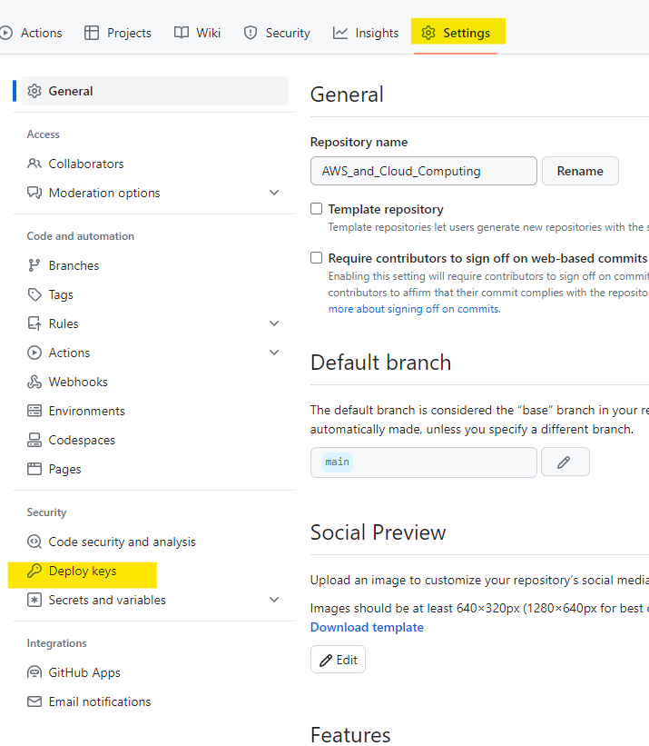
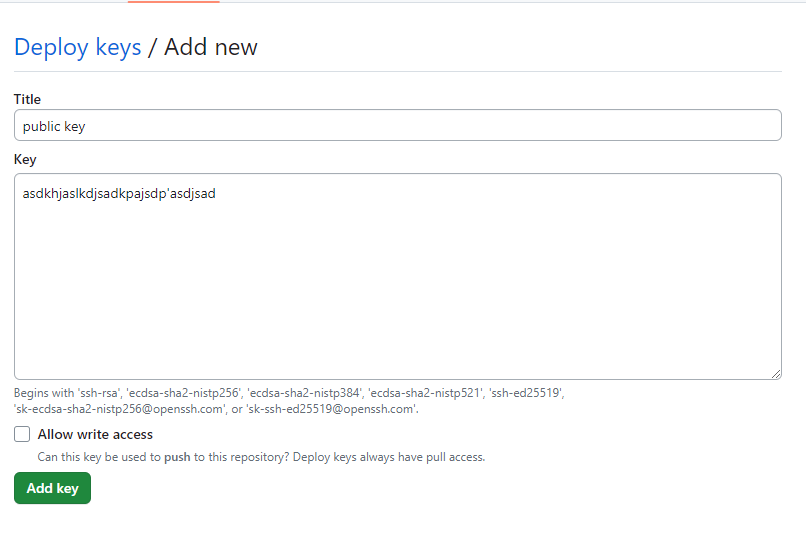
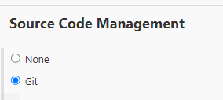
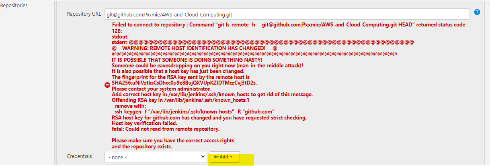
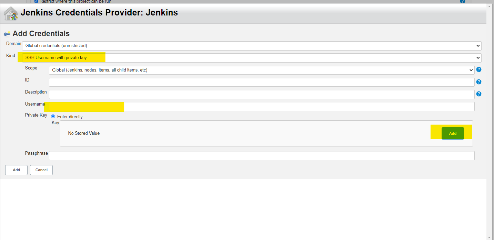
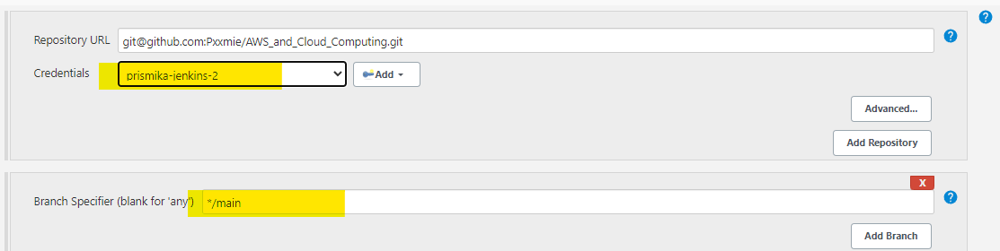

## Configuring SSH authentication between Github and Jenkins

### Generate SSH Key

1) First you need to generate a new SSH key in your GitBash terminal. Make sure the key is generated in your **.ssh** folder. You can navigate to it by running the following command: 
   ```
   Prismika@Pris MINGW64 ~
   $ cd .ssh
   ```

2) In order to generate SSH key in your .SSH folder you need to run the following command:
   
   *Make sure to press enter twice for when it asks for passphrase as we are not setting that up and make sure to enter a name for your key pair!*

   ```
   ssh-keygen -t rsa -b 4096 -C "youremail"
   ```

3) Now in order to get the context inside our public key we need to run the following command: 

   ```
   cat yourpublickeyname.pub
   ```

   We now need to copy this value into your GitHub. 

### Configure SSH key for GitHub Project

1) Log into your GitHub, go into your repository on which you have the app folder. Then go into settings > Deploy Keys > Add deploy keys: 
   
   

2) Click **Add Deploy** key and add a suitable name for your key and then copy the value inside your public key file under key. You need to also **allow write access** followed by add key.

   


### Add SSH Key inside Jenkins

1) When you are creating a new job in Jenkins, scroll down to Source Code Management and select Git.
   
   

2) Now we need to fill in the repository URL with our repo URL from GitHub which has the app folder. Then we need to add our private key in Jenkins by selecting **Add**.

   

3) After you press Add, you will be shown this screen where you need to select **SSH Username with private key**, fill in a suitable username, select **enter directly** followed by **Add**.

   

 4) Finally, after you have added your private key in, you should be able to find it by the username you named it. Then you need to change the branch to main.
   
      