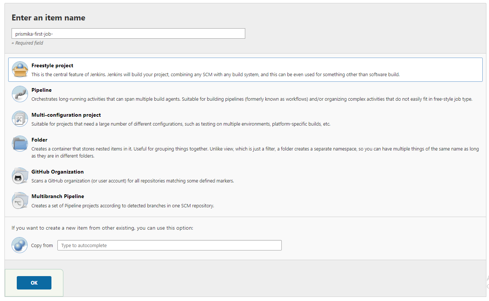

# Jenkins

### What is Jenkins? 

Jenkins is an open source automation server which offers a simple way to set up a continuous integration and continuous delivery environment.
 

It is used to continually create and test software projects, making it easier for developers and DevOps engineers to integrate changes to the project. For example, if your team is working on a project, Jenkins will continually test your builds and alert you any mistakes early in the process.
 

Organisations may use Jenkins to automate and speed up the software development process.

### Setting up a build job in Jenkins 

1) After logging into your Jenkins account, click the New Item link on the left-hand side of the Jenkins dashboard.
   

1)  Enter the new project's name and select the **Freestyle project** type. Click OK to continue.

