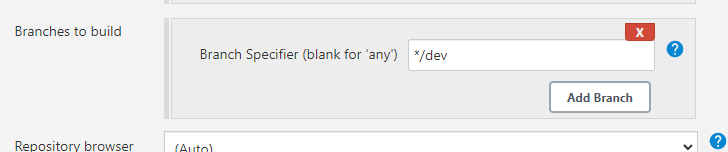
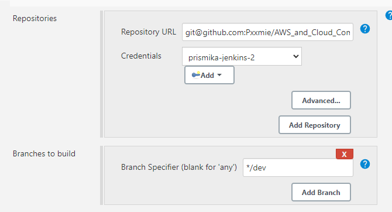
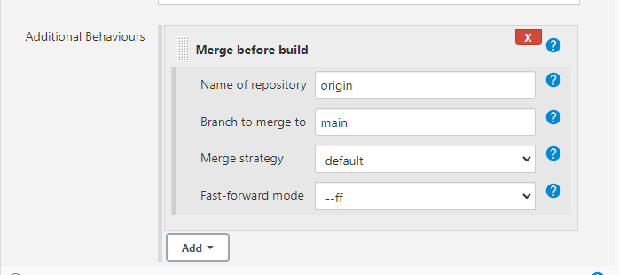
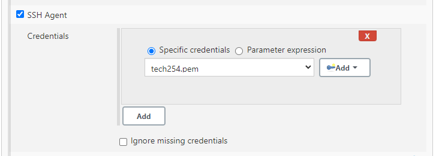
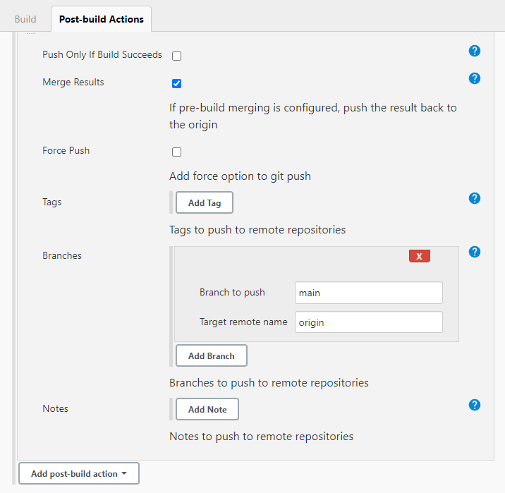
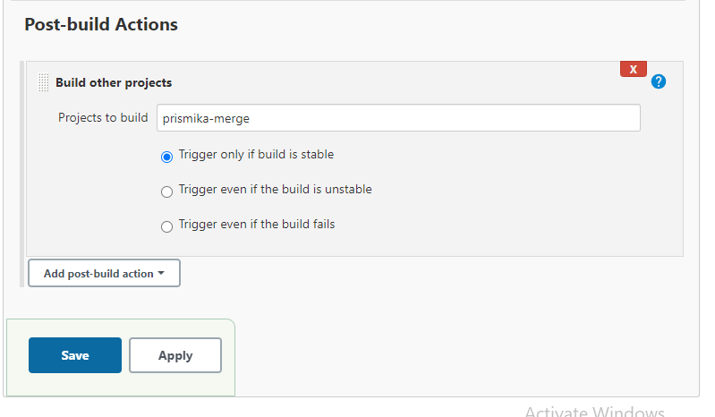

### Merging with git branches 
Below, I will be showing you How Jenkin can merge code from Dev to our Main branch if the tests all pass. 


1) In order to switch to Dev branch - you need to go to your gitbash terminal sand run the following command: 

```
git checkout dev
```

2) On Jenkins, from the job we have already created, scroll down to source code management and change your branch specifier from **main** to **dev**. Ssave these changes for now.

 

4) Go back to your Jenkins Dashboard, create a new job. We will name this job **merge**. As the settings before, link your github project url, make sure you are using the testing node - **Restrict where this project can be run**. Copy your SSH repo link from GitHub followed by the same deploy key you have added on your GitHub repo. We are going to enter **Dev** for *branch specifier** in this job too. 



5) Now we need to click on **Additional behaviour** followed by **Merge before build** from the drop down. Here we want to specify that we want to merge our code from dev branch to main branch. 
   


6) In order for our code to be depoloyed into production upon successfully passing tests and merging branches. We want to create an authentication from Jenkins to AWS, there is where we add our SSH agent. 



7) Now we need to add a post-build actions. Select **Git publisher**. This is where you specify which branches you want to push. In this case, I have entered main, which means if the tests pass, the **main** branch will be pushed to the configured remote repository. 
I have entered **origin**, as it indicates the default remote associated with the Git repository. 



## Post build Action on first job 

1) Now I go back to my first job which, where it handles my dev code. Under post build action, I will specifiy that if the tests passes on this job, then to trigger and start building my merge job which handles mergining my dev to main. I have made sure to select **Trigger only if build is stable** so it doesnt start building the other job until it passses the test. 
   
