## Merging code  with Git branches (Dev and Main)
Below, I have created a guide to show how to merge code from the Dev branch to our Main branch on Jenkins, provided that all tests pass.


 In order to switch to Dev branch - you need to go to your gitbash terminal and run the following command: 

   ```
   git checkout dev
   ```
### Creating First Job - Local Host to Dev Branch
1) Create a new job in Jenkins, give it an appropriate name i.e *prismika-ci* > select freestyle project followed by ok. 
   
   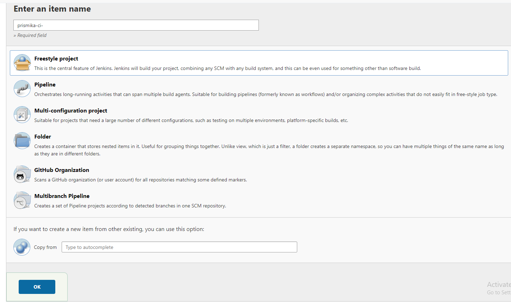


2) Add a brief description for the job > **enable discard old builds** and type in 3. Then **select GitHub project** and copy your project url into the field. 

   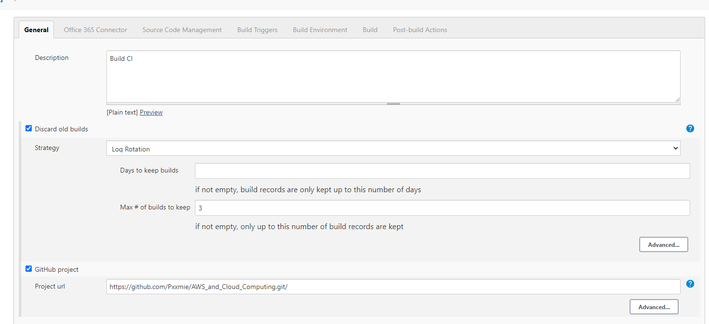

3) We want to **add a new webhook**, paste your project url followed by a suitable name. Then select **Restrict where the project can run** as we want it to run on the testing node. 

   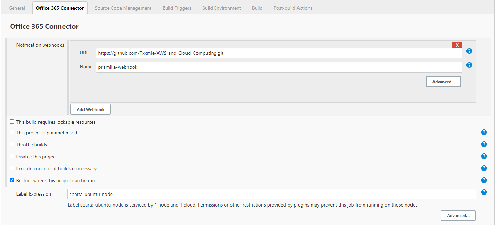

4) For Source Code Management, **select Git** followed by adding our GitHub repo SSH url and selecting our SSH private key we have created. For the Branch specifier, type in **dev**.

   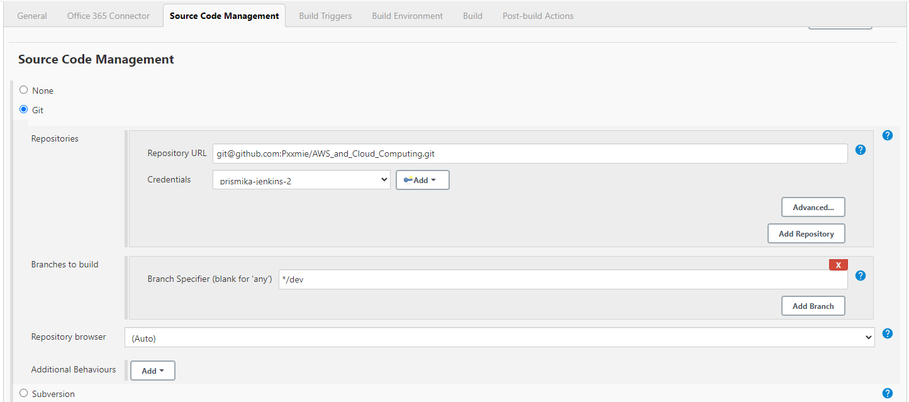

5) As we have added a webhook in order to trigger the Jenkins, we need to select **GitHub hook trigger for GITScm polling**. Then under Build environment, make sure to select **Provide Node & npm bin/folder to PATH** as this ensures Jenkins uses the correct versions without having to specify the full paths in your build scripts.
   
   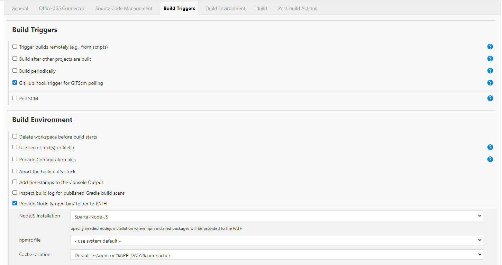


6) Finally, we need to select **Execute shell** from the drop down under Build option and enter the following commands: 
   
   ```
   cd app/app
   npm install 
   npm test
   ```
   Finally, we need to add some post-build steps. Select your second job from the drop down list and select trigger only if build is stable. This allows the second job to build upon successfully passing test for the first job. Click save. 
   
    *note that this is only added after you have created second job* 


   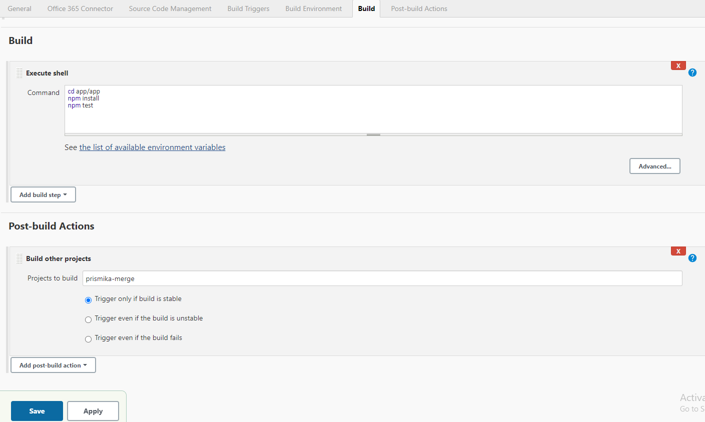

### Creating Second Job - Merge to Main

1) Follow same steps as above to create new job, give it suitable name ie *prismika-merge* followed by clicking on freestyle project. Then scroll down to source code management, click on **add additional behaviour** and select **merge before build**. This allows jenkins to merge dev branch to main. 

   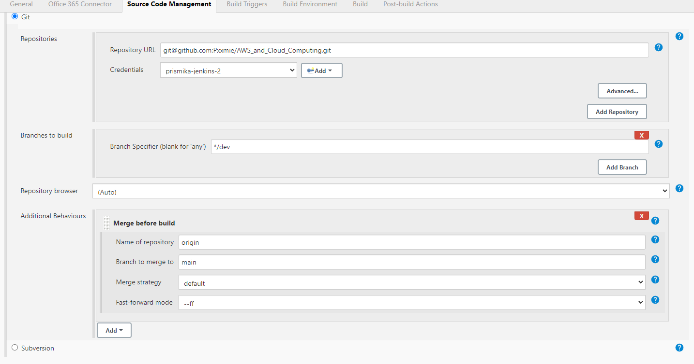

2) Scroll down to Build environment and select SSH agent, followed by selecting the your pem key.

   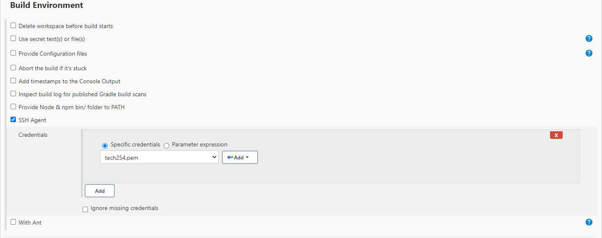

3) Finally, on post build actions, we need to select **Git publisher** from the drop down. Click on **push only if build succeeds** folowed by **merge results**.
Click on add tag on Branches and enter main for branch to push and origion for target remote name.
   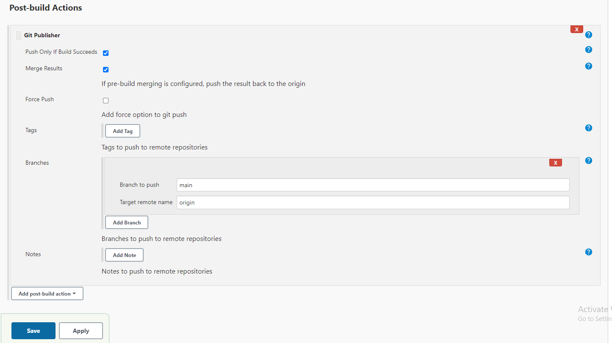

   
### Testing

After I have made some changes to my local repo and pushed to the dev branch, it should automatically trigger my first job to notify that I have made some changes. 

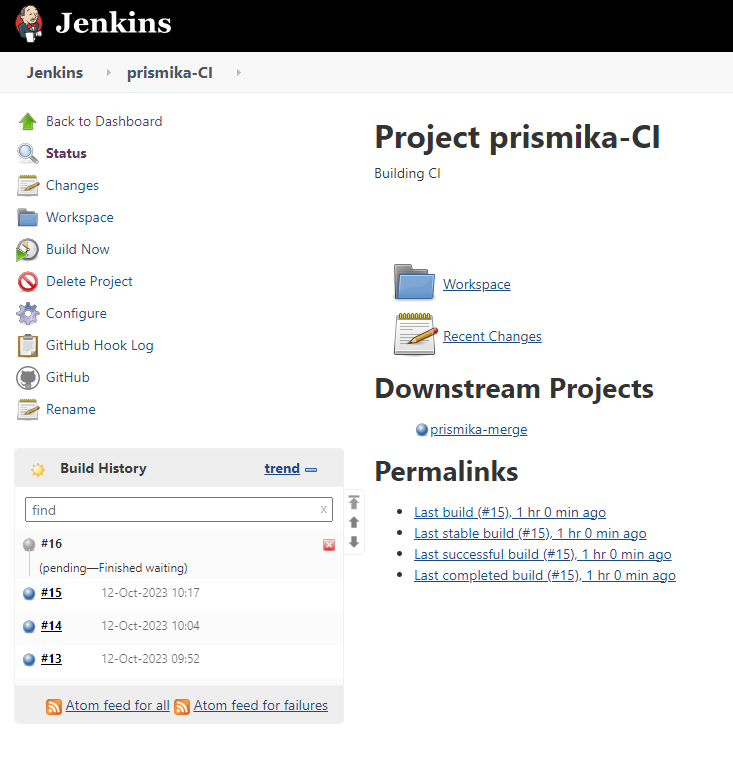

If the test has all passed on my first job, it will start the build on my merge job, which will also merge my code and changes from dev to main. Then it will push it out to the main branch. After this has been successful, it should show a blue circle next to your job as well as a sucessful console output. 

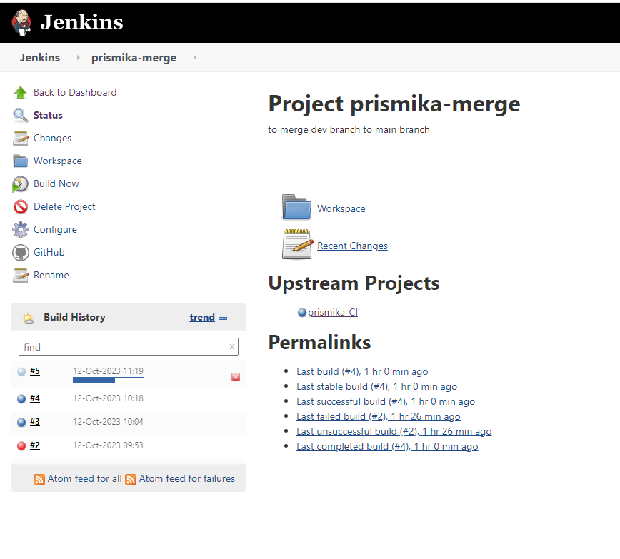


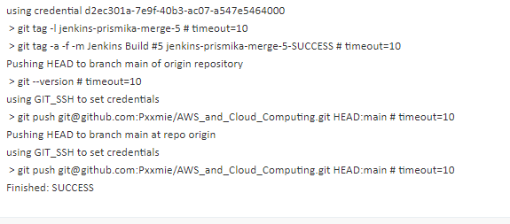