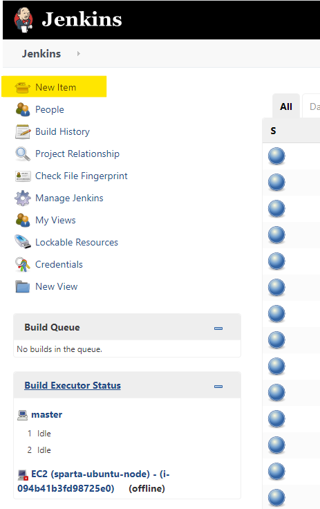

# Jenkins

## What is Jenkins? 

Jenkins is an open source automation server which offers a simple way to set up a continuous integration and continuous delivery environment.
<br>

It is used to continually create and test software projects, making it easier for developers and DevOps engineers to integrate changes to the project. For example, if your team is working on a project, Jenkins will continually test your builds and alert you any mistakes early in the process.
<br>

Organisations may use Jenkins to automate and speed up the software development process.


## Setting up a build job in Jenkins 

#### Testing Jenkins - Does Jenkins have the environment required for our deployment.

1) After logging into your Jenkins account, click the New Item link on the left-hand side of the Jenkins dashboard.
   
   

2)  Enter the new project's name and select the **Freestyle project** type. Click OK to continue.

    

3) I have given a brief description on what I want to test in this job. Followed by clicking on **Discord old builds** as we want a maximum of 3 builds so the server does not crash. 
   
   

### Adding Build Step 

4) Now scroll down to the Build Section. Select **Execute Shell** from the drop down. 
   
      

5) Finally, we want enter the commands you want to execute in the **Command** field. Followed by **clicking save** to save your job.  

   ```
   whoami 
   uname -a 

   ```

      


### Build the Job

1) After your job has been created, on the left hand side click **Build now** to run your job. 

   

2) The job will then show under Build history, if your commands have ran successfully it will show a blue circle, however if it has failed you will see a red circle. 
   
   

3) Finally you can right click on your job and press on console output to show the successful output or if it failed it will tell you the error on the output. 
   
   


   