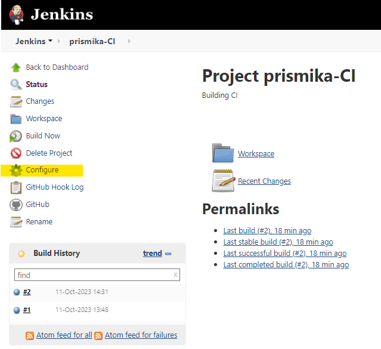
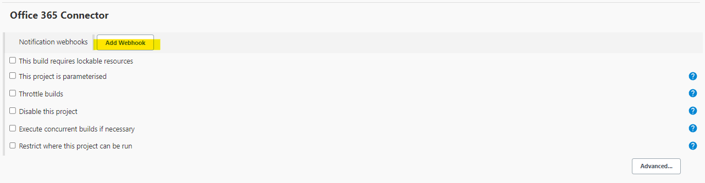
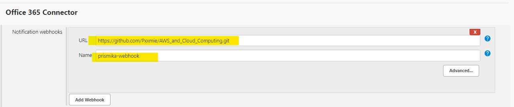
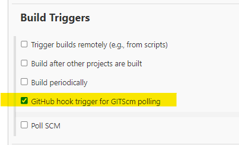
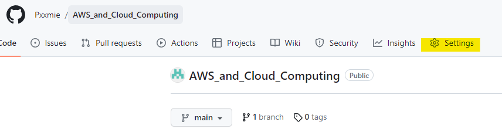
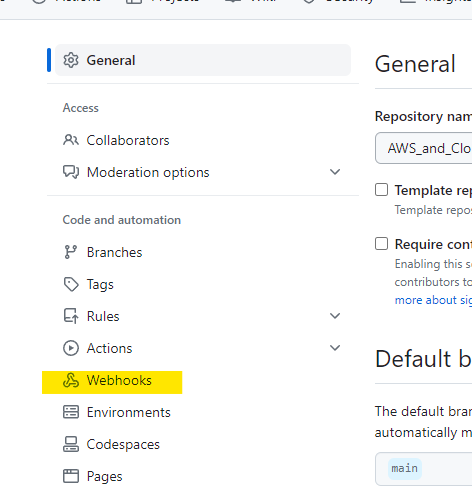
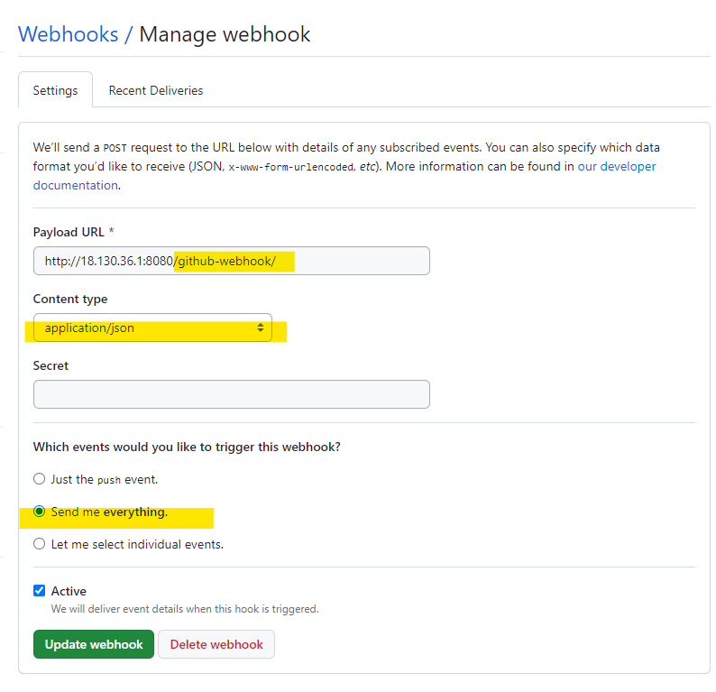
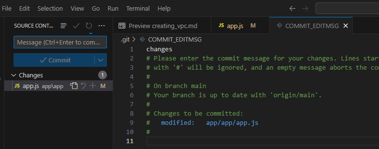
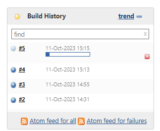
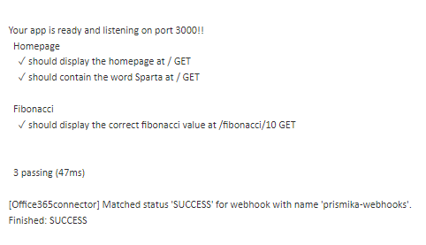

## Setting Up Jenkins GitHub Webhook

 After you have authenticated your GitHub with Jenkins, we want to set up  jenkins GitHub Webhook integration. 

 1) Once you have created a job and linked your GitHub repository. Go back into your job by pressing **configure**. 

    

2) Now scroll down to Office 365 Connector and click on add webhooks. 
 
    

4) Make sure to copy and paste your GitHub repoistory URL where your app folder is located. 
   
   

5) Go to **Build Triggers** after you have filled in your webhook and choose “**GitHub hook trigger for GITScm pulling**” option , which will listen for triggers from the given GitHub repository, as shown in the image below.
   
   

   Now click on the "Apply" button to save the changes. 

## Setting up GitHub Webhook 

1) Login to your Github account. Go to the repoistory of where your app folder is located. Click on settings on the top right of your screen. 

   

2) Click on **Webhooks** on the left hand side of the bar. 
   
   

3) Click on **Add Webhook**, and it should provide you with blank field to add the **Payload URL**, this is where you will paste your Jenkins address followed by **/github-webhook/** at the end of the URL. Select the **Content type** to be **application/json** format. 
Finally I have selected **send me everything trigger** and it will trigger, if there is any pull or push into the repo.

   

## Testing Webhook 

1) In order to test the webhook, I have made some small changes inside the app.js file in my local repo, by adding an exclamation mark at the end of 3000.

   ```
   app.listen(3000 , function(){
     console.log('Your app is ready and listening on port 3000!');
   });

   ```

2) Now I am staging and commiting my file to the remote repoistory.

   

3) On our Jenkins server, we can see the webhook has successfully been integrated as it has automatically triggered and started executing the job. 

    

    we can go into our console output to show that the job has been successful. 

   

